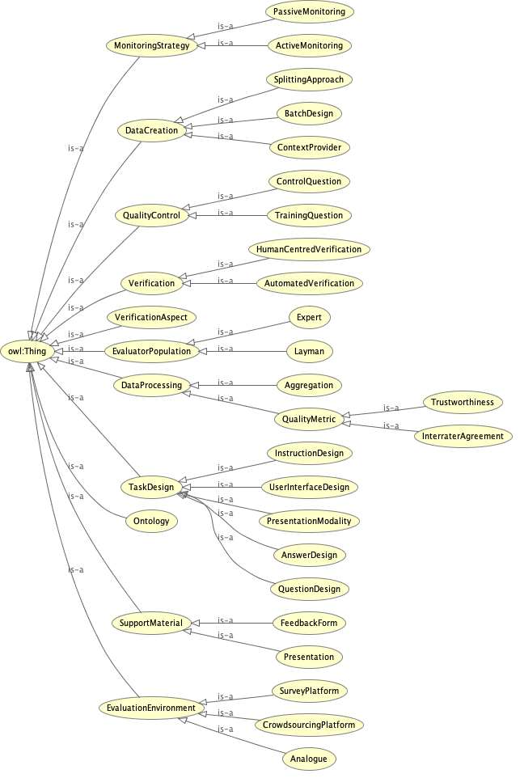

# Reference Architecture Enabling Tool-Support for Human-Centred Ontology Verification

## Overview Reference Architecture - Four Viewpoints

## Crosscutting Viewpoint

## Runtime Viewpoint
[Please refer to the process models.](https://github.com/k-klemens/hc-ov-process-models)

## Deployment Viewpoint

## Sourcecode Viewpoint

### Remarks
For a further description please to the write-up of the thesis.
